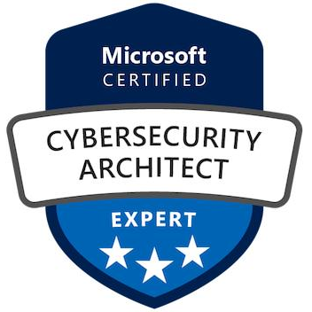
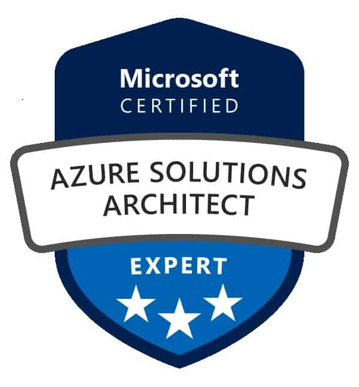

# Hello there, I'm Sebastian 👋

I work as a Lead Constultant & Cloud Architect at Devoteam M Cloud Munich. I enjoy learning, you can check my [Credly profile](https://www.credly.com/users/sebastian-staszek/badges).

I am particularly passionate about Azure infrastructure, network, security, migration, automation, IaC, DevOps and Azure Virtual Desktop:

A bit more about me:
- 👋 Hi, I’m @staszseb
- 👀 I’m interested in Azure infrastructure, security and network design, infrastructure-as-code 
- 🌱 I’m currently experimenting with Azure CAF supermodules
- 💞️ I’m looking to collaborate on automation, DevOps & GitHub deployment based on Terraform, PowerShell and JSON
- 📫 How to reach me: [@LinkedIn](https://www.linkedin.com/in/sebastian-staszek-7a964a187/), [@Xing](https://www.xing.com/profile/Sebastian_Staszek/web_profiles?expandNeffi=true))
- ⚡ Fun fact: Enthusiastic, open to new ideas and new topics, and willing to learn.

<!---
staszseb/staszseb is a ✨ special ✨ repository because its `README.md` (this file) appears on your GitHub profile.
You can click the Preview link to take a look at your changes.
--->
