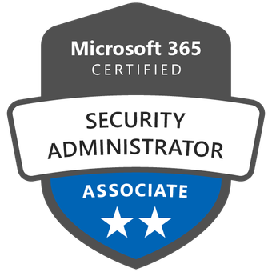
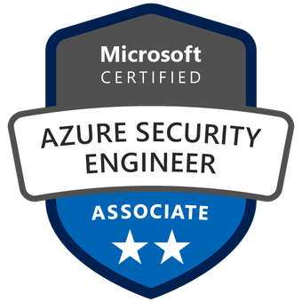
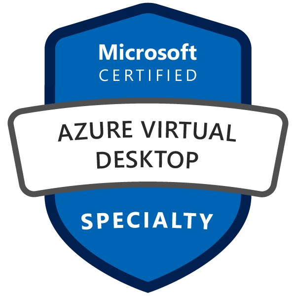

I work as a Lead Constultant & Cloud Architect at Devoteam M Cloud Munich. I enjoy learning, you can check my Credly profile [Credly profile](https://www.credly.com/users/sebastian-staszek).

I am particularly passionate about Azure architecture, security, and Azure Virtual Desktop:

I am particularly passionate about Azure architecture, network, migration, security, automation, and DevOps:
- 👋 Hi, I’m @staszseb
- 👀 I’m interested in automation, security, devops deployment, infrastructure and network design
- 🌱 I’m currently learning Azure CAF Supermodules
- 💞️ I’m looking to collaborate on automation and DevOps(GitHub deployment based on Terraform, PowerShell and JSON
- 📫 How to reach me: [@LinkedIn](https://www.linkedin.com/in/sebastian-staszek-7a964a187/), [@Xing](https://[www.linkedin.com/in/sebastian-staszek-7a964a187](https://www.xing.com/profile/Sebastian_Staszek/web_profiles?expandNeffi=true)/)
- ⚡ Fun fact: None

<!---
staszseb/staszseb is a ✨ special ✨ repository because its `README.md` (this file) appears on your GitHub profile.
You can click the Preview link to take a look at your changes.
--->
